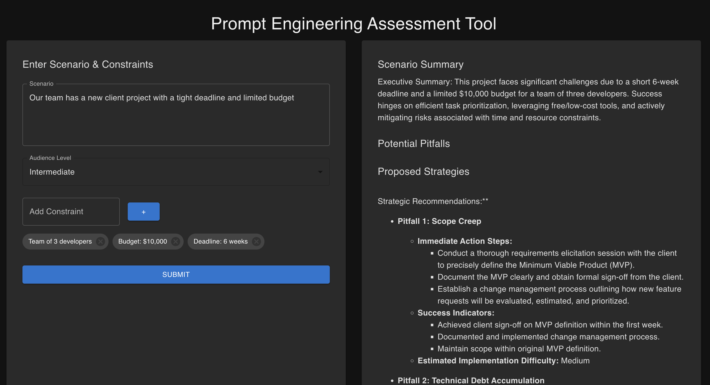
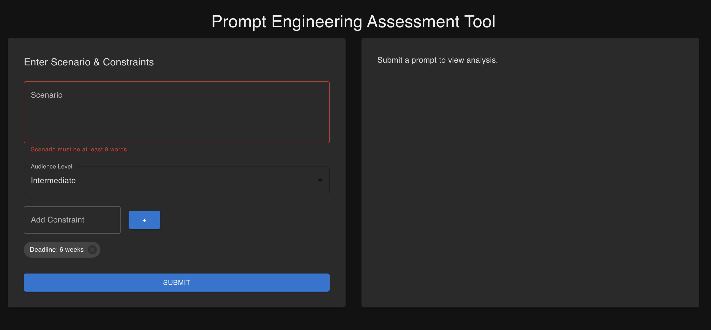
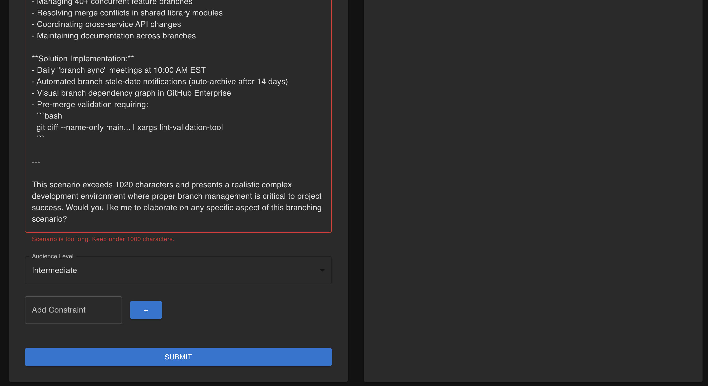
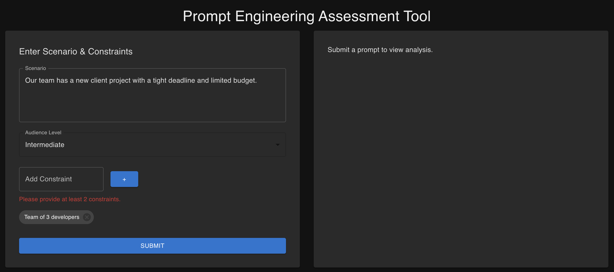
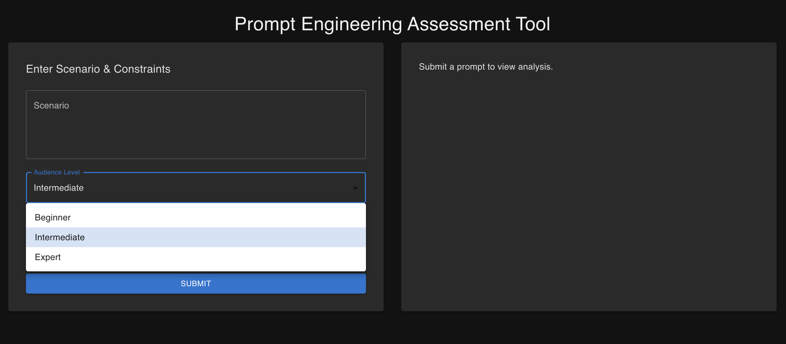

# Prompt Analyzer

A full-stack application for AI-driven scenario analysis using a React (Material UI) frontend and Spring Boot backend. It allows users to enter a prompt and constraints, and generates a structured response using a connected AI API (e.g., Gemini or OpenAI).

---

## 🧰 Tech Stack

- **Frontend**: React + Material UI
- **Backend**: Spring Boot (Java 17)
- **Build Tool**: Maven with frontend-maven-plugin
- **API Integration**: Google Gemini or OpenAI (configurable)
- **Deployment Ready**: Heroku

---

## 🚀 Local Development Setup

### 🔧 Prerequisites

- Java 17+
- Node.js (≥ 16.x recommended)
- Maven 3.8+
- Git (optional, for cloning)

---

### 📦 Clone the Repository

```bash
git clone https://github.com/YOUR_USERNAME/prompt-engineering.git
cd prompt-engineering

## 🛠️ Setup Instructions

### 1. Configure Gemini API Key

Create or edit the `src/main/resources/application.properties` file and replace:

```properties
gemini.api.key=REPLACE_WITH_YOUR_GEMINI_API_KEY
```

### 2. Build and Run Locally

```bash
# Clean and build the entire full-stack app
mvn clean install

# Run the Spring Boot application
mvn spring-boot:run
```

### 3. Frontend Access

Open [http://localhost:8080](http://localhost:8080) in your browser to use the app.

---

## 🧪 Unit Testing

- ✅ 10 test cases are included in `DemoApplicationTests.java`
- To run the unit tests:

```bash
mvn test
```

---

## 🔁 Switching Between Gemini and OpenAI

If you want to test using **OpenAI**, do the following:

1. Replace your API key in `application.properties`:
   ```properties
   openai.api.key=REPLACE_WITH_YOUR_OPENAI_API_KEY
   ```

2. In `DemoApplication.java`, change:

```java
@SpringBootApplication
@EnableConfigurationProperties(OpenAiConfig.class) // instead of GeminiConfig.class
```

3. In `AiService.java`:
   - Uncomment the OpenAI-related code
   - Comment the following Gemini-related code:
     ```java
     @Autowired
     private GeminiConfig geminiConfig;

     // ...and all code using geminiConfig until:
     private String buildPrompt(...)
     ```

---
🧪 Input Validation Rules

    Scenario must be at least 9 words

    Minimum 2 constraints required

    Choose an Audience Level:

        Basic

        Intermediate

        Expert

If validation fails, appropriate error messages will be shown.
---
📸 Screenshots
✅ Successful Prompt Submission

Displays the prompt entered, selected constraints, and structured AI-generated recommendations: 

🔴 Validation: Scenario Too Short

Displays an error if the scenario is less than 9 words: 

🔴 Validation: Scenario Too Long

If the scenario exceeds 1000 characters, an error is shown: 

🔴 Validation: Less than 2 Constraints

User must provide at least 2 constraints: 

🔄 Audience Level Dropdown

Supports “Beginner”, “Intermediate”, and “Expert” audience levels: 

---
👨‍💻 Author

Created by Barani Rajendran — feel free to fork, enhance, and contribute!

---